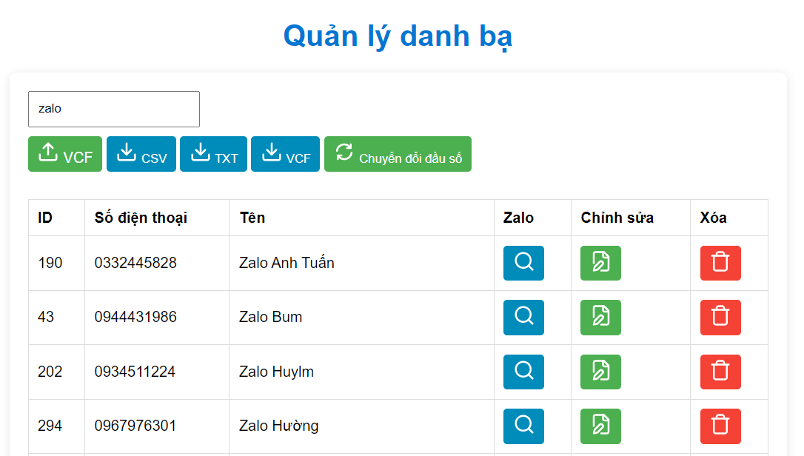

# Bài toán: Ứng dụng quản lý danh bạ

- Quản lý các liên hệ danh bạ (CRUD)
- Thực hiện chuyển đổi đầu số ([Xem tại đây](contents/documents/pictures/law.png))

# Các chức năng

- Xem các liên hệ
- Tìm kiếm liên hệ theo tên, số điện thoại
- Tìm kiếm liên hệ qua zalo
- Thêm mới liên hệ bằng form
- Sửa, Xóa liên hệ
- Chuyển đổi đầu số
- Thêm liên hệ bằng file .vcf
- Tải xuống dữ liệu (CSV, TXT, VCF)

# Công nghệ sử dụng

- Flask: Web framework ngôn ngữ Python
- Flask-SQLAlchemy: Kĩ thuật ORM làm việc với CSDL SQLite
- Jinja2: Sử dụng HTML, CSS, JavaScript tạo giao diện
- Docker: Đóng gói và triển khai ứng dụng

# Cách sử dụng

_Để có thể chạy dự án này, bạn sẽ cần cài đặt Docker_

Tải xuống bản sao của kho lưu trữ:

```bash
git clone https://github.com/whynotnghiavu/nghia-contact-manager.git
```

Điều hướng đến `docker-compose.yml`:

```bash
cd contents/code/docker
```

Tạo và khởi động container:

```bash
docker-compose -f "docker-compose.yml" up -d --build
```

Sau khi khởi động, truy cập ứng dụng qua địa chỉ: http://localhost:5000

# Giao diện người dùng


